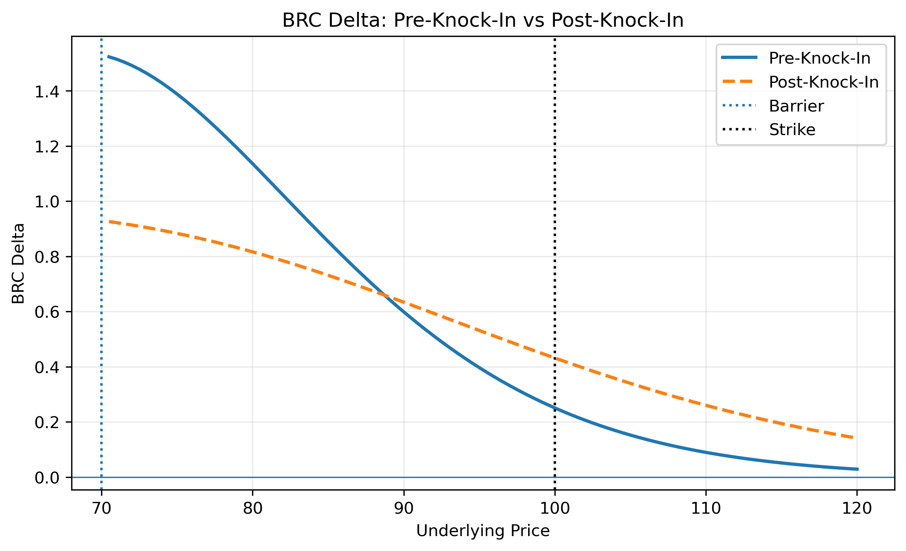
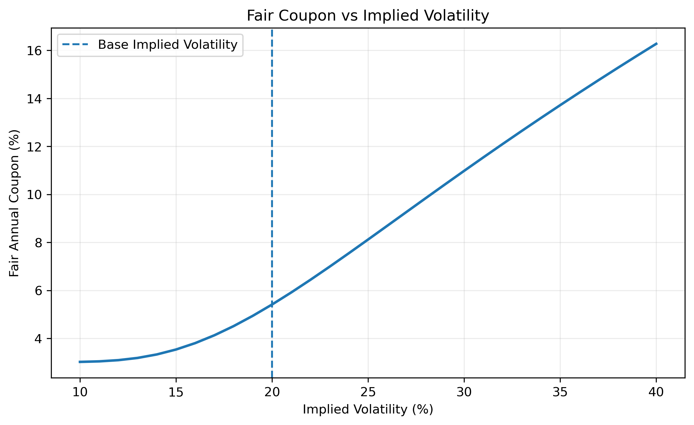
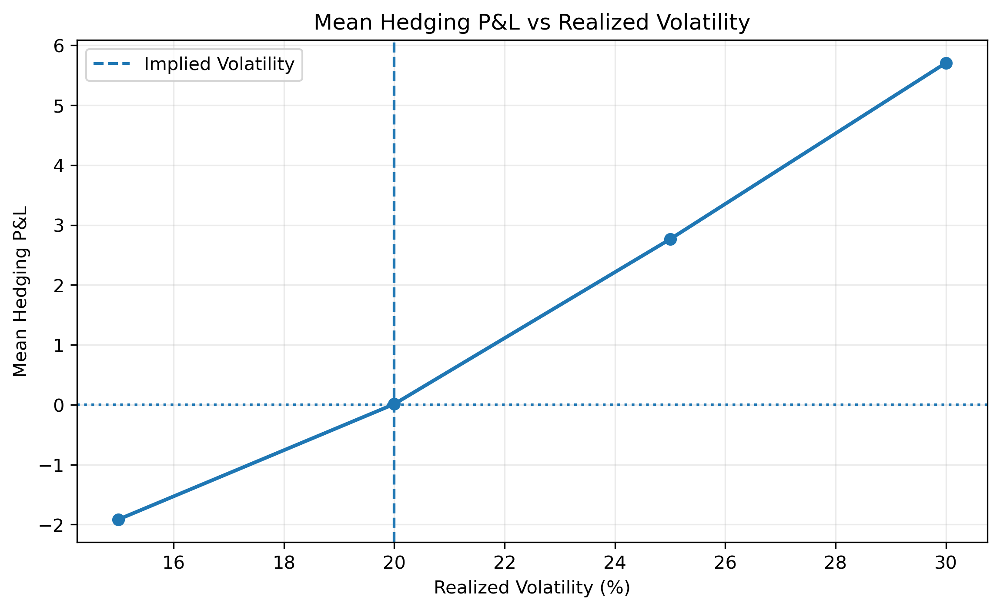

# Barrier Reverse Convertible — Pricing & Dynamic Hedging

Python implementation of the pricing, structuring and dynamic hedging of a single-stock Barrier Reverse Convertible (BRC), with a focus on the risk-management perspective of an equity derivatives desk.

The project covers the full trade lifecycle: payoff decomposition, fair coupon calibration, Greeks, continuous barrier monitoring, dynamic delta hedging and Monte Carlo analysis of residual hedging P&L.

---

## Product Structure

The note is a 1-year Barrier Reverse Convertible with:

- **Notional:** 100
- **Initial spot:** 100
- **Strike:** 100% of initial spot
- **Downside barrier:** 70% of initial spot
- **Barrier monitoring:** Continuous
- **Coupon frequency:** Quarterly
- **Issue price:** 100
- **Settlement:** Cash

The investor receives a fixed unconditional coupon and is exposed to downside risk if the barrier is breached and the underlying finishes below the strike.

Ignoring issuer credit risk, the product can be decomposed as:

$$
\text{BRC}
=
\text{Bond}
+
\text{Coupons}
-
\text{Down-and-In Put}
$$

The investor is therefore economically short downside optionality.

At maturity, excluding coupons, redemption is:

$$
R_T
=
N
-
\frac{N}{K}(K-S_T)^+
\mathbf{1}_{\{\min_{0\leq t\leq T}S_t\leq B\}}
$$

---

## Pricing Framework

The underlying is modeled under the risk-neutral measure using a Black-Scholes process:

$$
\frac{dS_t}{S_t}
=
(r-q)\,dt+\sigma\,dW_t
$$

with illustrative market inputs:

- **Risk-free rate:** 3%
- **Dividend yield:** 2%
- **Implied volatility:** 20%

The embedded down-and-in put is priced using in-out parity:

$$
P_{DI}=P_{\text{Vanilla}}-P_{DO}
$$

where the continuously monitored down-and-out put is valued analytically using the absorbing transition density of the log-price process.

The fair coupon is then calibrated such that the initial model value of the note equals its issue price:

$$
V_{\text{BRC}}(0)=100
$$

---

## Risk Analysis

The project computes the main equity-option sensitivities of the BRC:

- **Delta**
- **Gamma**
- **Vega**

Risk is analyzed both before and after the downside barrier has been breached.

Once knock-in occurs, the embedded down-and-in put becomes economically equivalent to a vanilla put:

$$
P_{DI}\rightarrow P_{\text{Vanilla}}
$$

Two BRCs with the same current underlying price can therefore have different values and hedge ratios depending on whether the barrier has previously been breached.



This path dependency is particularly important from a trading perspective because the desk's hedge depends not only on the current underlying price but also on the historical barrier state.

---

## Structuring Analysis

The fair coupon offered on the note depends on the value of the downside optionality sold by the investor.

Higher implied volatility increases the value of the embedded option and therefore affects the coupon required to issue the note at par.



The project also analyzes the relationship between the downside barrier and the fair coupon, illustrating the trade-off between investor protection and coupon enhancement.

---

## Dynamic Delta Hedging

The issuing desk is short the note and dynamically manages its equity exposure using the underlying stock.

Since:

$$
V_{\text{desk}}=-V_{\text{BRC}}
$$

the desk's delta is:

$$
\Delta_{\text{desk}}
=
-\Delta_{\text{BRC}}
$$

and the corresponding stock hedge is:

$$
n_t=\Delta_{\text{BRC},t}
$$

shares of the underlying.

A self-financing hedge account tracks:

- stock transactions,
- cash-account financing,
- dividend income,
- coupon payments,
- final redemption.

The hedge is updated throughout the life of the trade as spot, time to maturity and the barrier state evolve.

---

## Continuous Barrier Monitoring

Because the contractual barrier is continuously monitored, checking only daily simulated prices would miss barrier crossings occurring between observations.

Brownian-bridge crossing probabilities are therefore used between consecutive simulated prices.

For two observations above the barrier, the conditional probability of crossing the barrier during the interval is:

$$
P_{\text{hit}}
=
\exp\left(
-\frac{
2\ln(S_t/B)\ln(S_{t+\Delta t}/B)
}{
\sigma^2\Delta t
}
\right)
$$

This allows the simulation to capture continuous-barrier events while maintaining a daily time grid for the underlying paths.

---

## Monte Carlo Hedging Simulation

The hedging strategy is simulated across **5,000 underlying paths** using a vectorized Monte Carlo framework.

The simulation tracks the complete lifecycle of the desk hedge from issuance to maturity, including barrier activation, hedge adjustments, coupon payments and final redemption.

The analysis compares three hedge-rebalancing frequencies:

- **Daily**
- **Weekly**
- **Monthly**

Importantly, hedge frequency and barrier monitoring are treated separately: the barrier remains continuously monitored regardless of how frequently the desk rebalances its delta hedge.


The experiment illustrates that delta hedging removes local first-order equity exposure but does not eliminate residual risk generated by discrete rebalancing and nonlinear option exposure.

---

## Implied vs Realized Volatility

The note is initially priced and hedged using an implied volatility of:

$$
\sigma_{\text{imp}}=20\%
$$

Hedging performance is then simulated under four realized-volatility environments:

$$
\sigma_{\text{real}}
\in
\{15\%,20\%,25\%,30\%\}
$$

while keeping the pricing and hedging volatility fixed at 20%.



This experiment highlights the distinction between:

- **Implied volatility**, which determines the initial option value, fair coupon and hedge ratios;
- **Realized volatility**, which determines the actual path followed by the underlying after issuance.

The analysis also measures how realized volatility affects hedging-P&L dispersion and barrier-hit frequency.

---

## Independent Pricing Validation

The analytical continuous-barrier pricing engine is independently benchmarked against a Monte Carlo estimator using Brownian-bridge barrier crossing.

The analytical down-and-in put price is:

$$
P_{DI}^{\text{Analytical}}
\approx 2.3549
$$

while the independent Monte Carlo estimate using **500,000 paths** is:

$$
P_{DI}^{\text{MC}}
\approx 2.3677
$$

with a Monte Carlo standard error of approximately:

$$
SE_{\text{MC}}\approx0.0116
$$

The difference between the analytical and Monte Carlo estimates is approximately **1.1 Monte Carlo standard errors**, indicating that the observed pricing difference is consistent with simulation uncertainty.

This provides an independent numerical validation of the continuous-barrier pricing engine used throughout the project.

---

## Key Trading Insights

- The enhanced coupon compensates the investor for selling embedded downside optionality.
- Higher implied volatility increases the value of the embedded option and therefore affects the fair coupon available when structuring the note.
- Barrier activation materially changes the risk profile because the down-and-in put becomes economically equivalent to a vanilla put after knock-in.
- Current spot alone is insufficient to determine the value and hedge of a barrier product: the historical barrier state also matters.
- Delta hedging removes local first-order equity exposure but does not eliminate gamma, volatility, barrier or discrete-rebalancing risk.
- Hedge-rebalancing frequency affects the residual dispersion of hedging P&L.
- Differences between implied and subsequently realized volatility affect the performance and risk of the dynamic hedge.

---

## Model Limitations

The framework is designed to isolate the core pricing and hedging mechanics of a Barrier Reverse Convertible rather than reproduce a production structured-products pricing library.

The main simplifying assumptions are:

- Black-Scholes dynamics with constant volatility;
- constant risk-free rate and dividend yield;
- no volatility skew or term structure;
- no stochastic interest rates;
- no transaction costs or bid-ask spreads;
- no stock-borrow or funding spread;
- no issuer credit risk;
- discrete delta hedging;
- no explicit volatility or gamma hedging instruments.

In practice, an equity derivatives desk would incorporate market-implied volatility surfaces, funding and credit considerations, transaction costs, liquidity constraints and additional hedging instruments.

---

## Repository Structure

```text
reverse-convertible-hedging/
├── README.md
├── requirements.txt
├── .gitignore
├── notebooks/
│   └── reverse_convertible_hedging.ipynb
└── figures/
    ├── pre_post_knockin_delta.png
    ├── fair_coupon_vs_volatility.png
    ├── hedging_pnl_frequency.png
    └── hedging_pnl_realized_volatility.png
```

---

## Technologies

**Python · NumPy · Pandas · SciPy · Matplotlib · Jupyter Notebook**

---

## Disclaimer

This project is intended for educational and portfolio purposes. The model and numerical results should not be interpreted as investment advice or as a production-ready pricing framework.